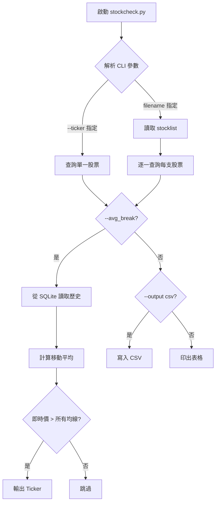
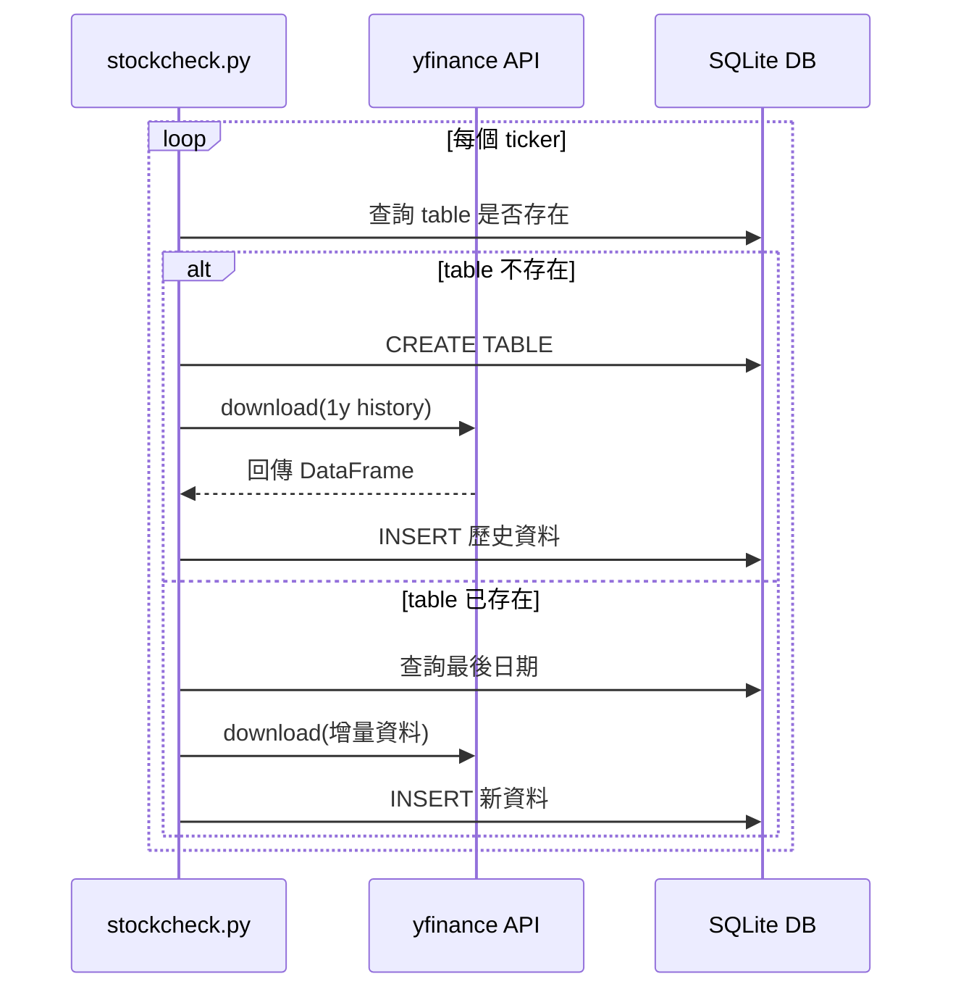
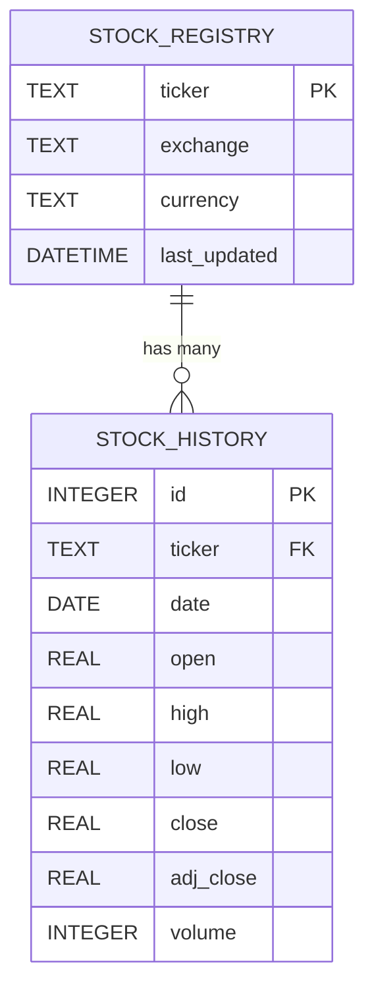

# 生成式 AI 應用系統與工程

**Generative AI Application Systems and Engineering**

**AIASE 2026 W2 - Basis of Vibe Coding**

莊坤達 Kun-Ta Chuang  
Dept. of Computer Science and Information Engineer  
National Cheng Kung University

---

## Recap and Remind

- **3/10 23:59 Deadline of HW1**
  - GitHub: [TAICA_AIASE2026/homeworks/HW1](https://github.com/ktchuang/TAICA_AIASE2026)

- 這門課是給末代武士上的，不要一直問不會寫程式可以上這門課嗎 - 不用煩惱寫程式的人生那麼棒，千萬不要跳火坑~

- **我們不協助你做 trouble shooting** - 你可以在 Discord 上私訊 TA，但以下的情況我們不會一一回應：
  - 沒有到信箱收邀請信
  - 邀請信在垃圾信箱
  - 錯把 google form 連結當成邀請連結，只填表單，沒有點 hw1 的邀請連結
  - Github classroom 還沒全自動匯入，這一個動作目前還保有人類 TA 處理的影子，會最遲每一天處理一次
  - Github 怎麼使用，要怎麼上傳

- **成大資工系辦通知：教室已增加一間實體教室進行同步教學 - 65405教室為主，65104線上同步（視情況開啟）**

---

## 作業早點寫，不然…

**Claude 當機！**

（無水、停電、崩潰、BOOM、CRASH）

---

## Recap of W1-Supplement1.md

- W1-Supplement1.md
- Dropbox: stock_video-w2.mp4

**Why did it perform badly in W1?**

---

## The Age from Software-as-a-Service to Agentic-as-a-Service

### THE LONG TAIL EFFECT IN APPLICATION SERVICES

A small number of popular apps capture the majority of users, while a vast number of niche apps collectively serve a significant user base.

| 排名 | 應用 | 用戶數 |
|------|------|--------|
| App 1 | (Social Media) | 520M Users |
| App 2 | (Video Streaming) | 480M Users |
| App 3 | (Messaging) | 410M Users |
| App 100 | | 100,000 Users |
| App 1,000 | | 50,000 Users |
| App 10,000 | | 15,000 Users |
| App 100,000+ | | 2,000 Users |

### THE EVOLVED LONG TAIL EFFECT IN THE AI AGENTIC CODING ERA

AI Agentic Coding enables personalized software creation, leading to an extreme concentration of users on a few core AI platforms, while a vast, hyper-long tail of niche, self-created apps serves individual needs.

| 排名 | 應用 | 用戶數 |
|------|------|--------|
| App 1 | Google AI Platform (e.g., Gemini) | 550M+ Users |
| App 2 | OpenAI Platform (e.g., ChatGPT) | 500M Users |
| App 3 | Anthropic Platform (e.g., Claude) | 450M Users |
| App 100 | Specialized AI Tools | 10,000 Users |
| App 1,000 | Niche Business Apps | 1,000 Users |
| App 10,000 | Personal Productivity App | 100 Users |
| App 100,000 | Custom Hobby Tracker | 10 Users |
| App 1,000,000 | Family Photo Organizer | 5 Users |
| App 10,000,000+ | Individual Task Automator | 1 User |

**Digital Sovereignty：Everyone can code to meet their own needs.**

---

## What will change from Long Tail to Hyper-Long Tail? 軟體產業的「自媒體化」趨勢

AI 編程的普及，正預示著軟體產業的「YouTube 時刻」。這將促使產業從過去的「工業化大生產」模式，轉型為「個體化、長尾化、去中介化」的全新生態系統。

### 個體化

超級個體開發者崛起，以 AI 工具實現高效率產出。

### 長尾化

滿足極小眾、極高頻需求，市場總量擴張但單品獲利降低。

### 去中介化

軟體從工具轉變為專家洞察力的載體，用戶直接訂閱解決方案。

**四大趨勢觀察：**

1. 軟體服務帶來的客戶效益提升，將被定義為最重要的考量，不再是服務的複雜度跟增長性
2. 用客不再為其自身無需求的開發項目買單，「大眾化餵食」將式微，「專業小眾化」服務將大增
3. 市場總量將大幅膨脹，但價值將從「製造軟體」轉移到「策展、分發、品質保證」這三個環節。
4. 軟體民主化將帶來未經審計的應用、安全漏洞與責任歸屬等問題，催生新的「軟體安全認證」。

---

## 軟體產業的「LLM平台化時刻」：五大未來預測

我們將「AI Coding 的普及」視為軟體界的「YouTube 時刻」，那麼軟體產業將從「工業化大生產」轉向「個體化、長尾化、去中介化」的生態系統。

### 1. 軟體市場的「長尾大爆發」：從通用 SaaS 到「極致利基」

**推演：** 傳統軟體公司為了維持利潤，必須鎖定「大眾需求」。當開發門檻降至幾乎為零，市場會出現無數個針對極小眾、極高頻需求的「一人軟體」。就像現在有專門教人「如何種植多肉植物」的百萬 YouTuber，未來會出現專門為「某種特定手作工作室」或「某種罕見疾病家庭」量身打造的極致利基軟體。

**結果：** 市場總量（TAM）會因為這些過去被忽略的小眾需求被滿足而急劇擴張，但每一款軟體的平均獲利會降低，呈現出如自媒體般的長尾分布。

### 2.「超級個體」取代「中型代工公司」

**推演：** 在自媒體時代，一位優秀的創作者加上 AI 剪輯工具，產出能抵過一家小型電視台。軟體業將出現「超級個體開發者」，一個人利用 AI 代理（Agents）進行架構設計、寫 Code、自動測試與部署。

**結果：** 過去需要 20 人規模的軟體外包或中型 SaaS 公司將失去競爭力，因為他們的溝通成本與人力成本，遠高於一個懂得指揮 AI 的超級個體。

### 3. 從「購買軟體」轉向「訂閱人格與解決方案」

**推演：** 自媒體觀眾不只是看影片，更多是認同「人」與其「觀點」。軟體將變得「有溫度」，用戶訂閱的不再是冰冷的工具，而是某位領域專家（Domain Expert）開發的、帶有其獨特邏輯與見解的系統。

**結果：** 軟體的競爭力將從「程式碼優劣」轉向「領域洞察力」。例如：一位資深會計師調教出來的 AI 財稅系統，會比科技巨頭做的通用會計軟體更受特定族群歡迎。

### 4. 平台戰爭：從「功能競爭」轉向「流量與信譽分配」

**推演：** YouTube 本質上不產內容，它提供的是分發（Distribution）與信任（Trust）。未來會出現「軟體界的 YouTube」，這類平台不自己寫程式，而是提供一個框架，讓成千上萬的個人軟體能安全、穩定地運行，並根據算法推薦給需要的用戶。

**結果：** 掌握用戶入口（如 ChatGPT、Claude 或新的系統層）的平台將擁有最高話語權。他們負責處理最累人的「營運、支付、安全審核」，而開發者負責「創意與邏輯」。

### 5.「軟體衰減」與「動態修復」成為新常態

**推演：** 自媒體的內容是有時效性的，軟體亦然。當軟體產出變容易，維護舊軟體的動力會下降。未來的軟體可能不再是「長久保固」，而是「即時生成、即時消亡」。

**結果：** 系統會進化到「自癒模式」。當 API 改版或出現 Bug 時，AI 會自動偵測並在毫秒內完成代碼重寫。開發者與用戶都不再執著於「穩定版本」，軟體進入一種動態發展的狀態。

---

## 軟體堆疊的護城河正在崩潰

**核心論點：CRUD 流程型 SaaS 即將被 Agent 吞噬**

### 衝擊已在發生

Anthropic 預測：AI Agent 將於 2026 年取代大多數傳統軟體產品。

Claude Cowork 發布後，市場反應立竿見影：

| 公司 | 跌幅 |
|------|------|
| Thomson Reuters | −15.8% |
| LegalZoom | −19.7% |
| RELX | −14% |

Agent 的目標從不是「整合」現有 SaaS，而是繞過並取代它們。

### 最危險的兩種商業模式

Google 副總裁 Darren Mowry 點名兩類高風險模式，這些企業正站在淘汰邊緣：

- **⚠ LLM 套殼：** 在基礎模型上加一層薄薄的 UX，幾乎沒有自有 IP。一旦巨頭跟進，產品即消失於市場。
- **⚠ AI 聚合器：** 整合多模型的中間商角色，正在重演 AWS 時代中間層被徹底淘汰的歷史。

### 受衝擊最深的企業類型

- 以「掌握資訊先機」為核心競爭力的企業
- 以「數位化流程」為主要服務的 B2B SaaS

---

## 新護城河：專有數據 × 深度領域 × 即時洞見

**核心論點：擁有別人拿不到的數據與知識，才有未來。** 護城河的本質已從「功能壁壘」轉移至「數據壁壘」——演算法可被複製，但私有數據與領域深度無法被合成。

### 護城河強度對照

| 競爭模式 | 可複製性 | 護城河強度 |
|---------|---------|---------|
| 流程自動化 / LLM 套殼 | 極高 | ⬛ 弱 |
| 公開數據分析 | 高 | ⬛ 弱 |
| 即時真實市場數據收集 | 低 | 🟧 強 |
| 專有領域數據 + 深度整合 | 極低 | 🟩 極強 |

### 標竿案例：Isomorphic Labs 的閉源宣言

- **AlphaFold 2（2021）開源：** 全球 300 萬科學家受惠，DeepMind 摘下諾貝爾獎桂冠，開源成就科學里程碑。
- **IsoDDE（2026）選擇完全閉源：** 性能全面超越前代，但與禮來、諾華合作取得的私有實驗數據才是真正的護城河所在。

**核心啟示：護城河 ≠ 演算法；護城河 = 私有數據壁壘 × 領域深度**

### 競爭力框架

| 層級 | 名稱 | 說明 |
|------|------|------|
| Layer 1 | 工具使用力 | 「會用 AI」是最低門檻，非競爭力 |
| Layer 2 | 流程設計力 | 能設計 Agent 工作流，而非只是使用它 |
| Layer 3 | 數據洞見力 | 擁有別人無法取得的數據來源與領域知識 ← 這才是真正的護城河 |

**核心提問：** 你的領域，有哪些數據是真正難以取得、難以合成的？你對某垂直領域的理解，是否深到可以設計 Agent 工作流？AI 讓「流程」徹底商品化——未來競爭的本質是誰擁有別人沒有的洞見來源。

---

## Recap - Software Development Roles/Tasks Spectrum

### 軟體開發「樹鞦韆」經典圖

（客戶說明他們想要的 → 主持人對客戶需求的認知 → 系統分析師設計的 → 程式設計師寫出來的 → 顧問描繪的願景 → 文件 → 最後交付給客戶的軟體 → 客戶所付的錢 → 上線後的技術支援 → 客戶真正需要的）

### 軟體開發職務光譜

| Internal Software Development ← → External Commercialization |
|---|

| 核心技術與基礎設施 | 工程與架構 | 產品與設計 | 文件與合規 | 客戶與專案支援 | 市場與業務成長 |
|---|---|---|---|---|---|
| Library / Kernel Dev | Software Engineer | Scrum Master / Agile Coach | Technical Writer / Documentation | Project Management | Marketing |
| SRE / IT Infrastructure | System Architect | Release Management | Legal / Compliance | Customer Support | Business Development |
| DevOps / Platform Engineering | Quality Assurance | System Designer | | FAE (Field Application Engineer) | Sales |
| System Security | Data Engineering / Data Science | UX/UI Design | | Pre-Sales / Solution Engineer | |
| | Tech Lead / Engineering Manager | System Analyst | | Customer Success / Account Consultant | |
| | | Product Management | | | |

---

## 軟體開發範式的崩解與重構

AI 時代，傳統軟體開發模式正在被顛覆，從流程、角色到規劃，一切都在重塑。

### 1. 流程之死：從「雙鑽石」到「非線性迭代」

- **過去：** (雙鑽石) 發散、收斂、原型、測試，時程以月計，按部就班。
- **現在：** AI 讓 Mockup 與開發時間縮短 60% 以上。流程必須隨時隨地發生，甚至直接在 Production 環境測試，走向非線性迭代。

### 2. 界限消失：開發者與設計師的職能重疊

- **設計師：** 開始寫程式，利用 AI Agent 提交 PR，實現設計即代碼。
- **工程師：** 必須具備產品感與設計直覺，因為初版多由 AI 生成，人類負責最後一哩的打磨。

### 3. 願景的保鮮期：從「五年計劃」到「三個月滾動」

- AI 進展太快，長期的技術規劃已失去意義。
- **核心能力：** 不再是「預測未來」，而是「極速反應」與「現場決策」，實踐三個月滾動式規劃。

**告別「標準流程」，擁抱「即時協作」。**

> *Dont Trust the Design Process, Jenny Wen, Head of Design, Anthropic*

---

## 人才原型

在 AI 時代，團隊的組成需要新的思維

### 強泛才：「方塊型」人才

在 T-shaped 框架裡，不只橫向知識廣泛，每項垂直專業都至少達到 80 分位。在設計角色延伸至 PM 和工程師的時代，多領域紮實能力讓擴張更為容易。

### 深度專家：領域前 10%

專精於某個領域，達到全產業前 10% 的水平。例如，技術型設計師（擅長與 AI 模型互動）或在視覺設計等子領域有極深造詣者。在「還行」的東西隨處可見的時代，能創造「明顯不一樣」的人彌足珍貴。

### 出色的新人：潛力無窮

資歷淺但展現超齡成熟度，謙虛、渴望學習且學習速度極快。在角色和期望快速變化的環境中，沒有舊包袱的新人反而具有巨大優勢。

**這三種人才將共同推動團隊在快速變化的 AI 時代中保持領先**

> *Dont Trust the Design Process, Jenny Wen, Head of Design, Anthropic*

---

## 軟體開發的流程光譜 - 認知與實作的對話

**從不明確需求的「升維建構」到工程實作的「降維打擊」**

### 核心理念

軟體開發不是單向的「翻譯」，而是跨維度的「轉譯」。每一個功能的誕生，都歷經一段從模糊到清晰、從宏觀到精確的維度旅程。

### 工程師的核心價值

頂尖工程師的差異化能力，在於具備穿梭不同維度的認知能力——既能在霧中看見全局，也能在細節中掌控品質。

---

## 釐清與對焦：將一維片段升華為三維藍圖

**第一階段：升維建構 DIMENSIONAL ASCENSION**

需求的本質往往是碎片化、非結構化的。升維建構的核心挑戰，是消除人與人之間的**想像落差**，將不明確的願景轉化為可執行的明確藍圖。

| 輸入（低維資訊） | 升維策略（過程） | 產出（高維 Artifact） |
|---|---|---|
| 片面的口頭需求、零碎的文字描述、不明確的模糊想像 | 訪談探索、視覺化設計、圖像力重構——將原始資訊「包裝與重構」 | 系統架構圖、使用者旅程地圖、UI/UX 視覺藍圖 |

### 案例 - 台南東區小吃店智慧化系統

**老闆的原始需求（1D）** 僅是一句話：「排隊太亂了。」

**升維後的三維藍圖（3D）：**

- 深入分析現場人流動線與瓶頸點
- 定義「點餐」與「取餐」的獨立狀態機邏輯
- 設計掃碼自助點餐互動介面與即時叫號系統
- 需求預測、庫存提醒

**1D → 2D → 3D：升維的想像力：從點到面到體**

---

## 實現與優化：高維知識對低維實現的精準打擊

**第二階段：降維打擊 DIMENSIONAL DESCENT**

當宏觀藍圖已然清晰，真正的工程挑戰才正式開始。降維打擊的精髓在於——在資源約束下，以高維度的技術視野，將複雜系統藍圖轉化為極致效能的程式碼。

| 起點：高維藍圖 | 過程：技術降維路徑 | 產出：1D 可執行片段 |
|---|---|---|
| 面對複雜的系統架構與多層業務邏輯，全貌清晰但實現路徑仍充滿挑戰。 | 基於高維度視野，精準判斷成本、效能、穩定度與吞吐量的最佳平衡點。 | 將複雜藍圖精準拆解為可執行的代碼片段、API 介面與 Webhook 自動化流。 |

### 案例 - 高共用性餐飲數位服務平台

**目標：** 服務數萬用戶、實現零停機持續部署

**降維打擊的實踐策略：**

- 利用微服務架構解構單體系統複雜度，各自獨立部署與擴展
- 針對底層資料庫索引策略進行精準最佳化，大幅提升查詢效能
- 驗證系統韌性，確保高可用性

**3D → 2D → 1D：降維的執行力：從藍圖到程式碼**

---

## 軟體開發的維度光譜 — Software Development Spectrum

> ktchuang.github.io

---

## 想像力的探索堆疊升維 × 執行力的綜觀拆解降維

**結語：頂尖開發者的跨維度修煉**

### 升維能力

決定了我們是否在做「**正確的事 (Do the right things)**」。需要感知力與圖像化能力——從文字（1D）中看見空間結構（3D），在霧中識別方向。

### 降維能力

決定了我們是否把「**事做正確 (Do the things right)**」。需要極高的技術深度與掌控力——將藍圖（3D）優雅地收納進精準代碼（1D）。

### 給每位工程師的修煉筆記

- 不要當一個只會敲鍵盤的**低維操作員**——突破執行慣性，培養系統思維
- 訓練自己從一句話需求（1D）中看見完整的空間藍圖（3D）
- 同時培養將複雜藍圖（3D）優雅收納為可執行代碼（1D）的降維能力

**軟體工程的藝術，就在這升降之間。掌握維度轉換，你便掌握了 AI 時代工程師最深層的核心競爭力。**

> f_ascend(R_raw) → A_blueprint ← → g_descend(A_blueprint, C_constraints) → Code_execution
>
> 一個頂尖的軟體人才，必須同時具備『升維的想像力』與『降維的執行力』

---

## AI 時代的軟體人才升級 - Forward Deployed Engineer 思維

**「到客戶現場」或「面向客戶」去解決最困難 技術/非技術 問題的工程師**

### AI 時代軟體開發鐵三角

| 角色 | 定位 | 核心職能 |
|------|------|---------|
| FDE/PM (Navigator) | 即時指引方向，確保產品快速進入市場並產生價值。 | 市場洞察、策略規劃、價值驗證、敏捷迭代 |
| Agent Architect (Human Guardian) | 從「寫程式的人」升級為「規模與品質守門員」，負責系統設計、資安與品質把關。 | 系統架構設計、資安防護、代碼品質審查、邏輯驗證 |
| AI Agents (Drivers) | 擔任高速實作的 programmers。 | 自動化編碼、快速原型開發、測試與除錯、持續集成/部署 (CI/CD) |

### AI 時代成長曲線

- **關鍵轉折：** 跟 AI 協作能不能比 AI 單獨工作產出更多價值？
- 傳統職場成長曲線：新人 → 中堅 → 專家（線性成長）
- AI 時代成長曲線：突破關鍵轉折後，高價值爆發

---

## Dancing with AI Coding

### 如何與 AI 協作完成程式開發

AI 是你最強大的加速器，但方向盤永遠在你手上。Vibe Coding 的精神不是「讓 AI 替你寫程式」，而是「你懂程式，AI 成為你的加速器」。

---

## SDD vs PRD：從需求文件到可執行規格的差異

傳統 PRD 以自然語言描述「做什麼」，服務對象是人類利害關係人；SDD 則以結構化規格驅動整個開發週期，同時服務人類與 AI 系統兩種讀者。

### 傳統 PRD (Product Requirements Document)

- **定位：** 描述「做什麼」與「為什麼做」的產品規劃文件
- **讀者：** PM、設計師、工程師等人類利害關係人
- **表達方式：** 自然語言為主，容許模糊與隱含假設
- **典型內容：** 使用者故事、商業目標、成功指標、功能清單
- **侷限：** 需要人類再轉譯才能進入實作，資訊在傳遞過程中容易失真

### SDD（Spec-Driven Development 規格驅動開發）

- **定位：** 以精確規格驅動整個開發週期的方法論
- **讀者：** 人類 + AI 系統（雙重消費者）
- **表達方式：** 結構化 Markdown，將語意模糊降至最低
- **典型內容：** 輸入/輸出定義、狀態轉換、邊界條件、驗收標準、Mermaid 架構圖
- **優勢：** 規格即藍圖，可直接驅動 AI 生成程式碼、測試與文件

### 比較表

| 面向 | PRD | SDD |
|------|-----|-----|
| 主要讀者 | 人類團隊 | 人類 + AI |
| 模糊容忍度 | 高（靠溝通補齊） | 極低（AI 不會腦補） |
| 可執行性 | 參考文件，需轉譯 | 可直接驅動開發 |
| 生命週期 | 前期規劃階段 | 貫穿整個開發週期 |
| 核心語言 | 自然語言 | 結構化 Markdown |

---

## AI 時代的規格思維：從 Prompt 到 Spec 的能力階梯

**寫不好規格的人，也寫不出好的 Prompt。結構化表達能力，是 AI 時代的基礎素養。**

| Level | 名稱 | 說明 |
|-------|------|------|
| Level 0 | 自然語言描述 | 模糊、含有隱含假設、一次性指令。是大多數人的起點，但也是 AI 協作效率最低的層次。 |
| Level 1 | Markdown 結構化表達 | 運用標題層級、表格、清單與程式區塊，比自然語言精確，比程式語言易學，是人機溝通的最佳起點。 |
| Level 2 | 結構化 Prompt | 加入明確約束條件、範例驅動與輸出格式定義，大幅降低歧義，讓 AI 回應更可預測、更可重現。 |
| Level 3 | 模組級規格 | 定義元件介面契約，引入 Mermaid 等視覺化架構圖，描述元件間的依賴與互動關係，使 AI 能理解系統邊界。 |
| Level 4 | 完整 SDD 規格 | 整合系統級架構、驗收標準與迭代計畫。規格本身即可驅動 AI 生成程式碼、測試案例與部署文件。 |

### 教學實踐路徑與關鍵原則

- **Agency over Passivity：** 主動定義規格，而非被動接受 AI 輸出。掌握主導權才能確保品質。
- **Incremental Snowball：** 程式無法一步到位，用規格拆解功能、逐步滾動開發，讓複雜度可管理。
- **Research First：** 先研究既有架構與技術方案，再撰寫規格驅動實作，避免重工與方向偏差。

---

## 前提：你必須擁有基本的程式語言觀念

如果你是一個完全不會寫程式的人，使用 AI 來撰寫程式其實**充滿風險**。你很有可能寫出一個看起來可以運作，但實際上邏輯錯誤的程式——因為你無法辨識 AI 產出的結構是否正確。

### 1. 理解架構

你不需要背語法，但你必須理解程式的結構與邏輯流程——包括變數、迴圈、函式與模組化設計。

### 2. 驗證能力

能閱讀 AI 產生的程式碼，判斷它是否正確運作，並找出潛在的邏輯漏洞。

### 3. 迭代引導

能給 AI 精確的回饋，引導它修正錯誤並逐步完善功能，而不是漫無目的地重試。

> 💡 **Vibe Coding ≠ 不懂程式也能寫程式。 Vibe Coding = 你懂程式邏輯，所以你能高效地「指揮」AI 幫你實作。**

---

## 動手之前：先做技術調研（Technical Discovery）

### 為什麼要先調研？

許多人拿到需求就直接開始請 AI 寫 code，結果走了大量冤枉路——選錯框架、忽略資安問題、用了即將被淘汰的 API。**在寫第一行 code 之前，先花時間了解「別人怎麼做類似的事」，這是專業開發者的基本功。**

- ❌ **沒有調研：** 直接開工 → 選錯框架 → 遇到資安問題 → 用了廢棄 API → 大量重工
- ✅ **先做調研：** 了解全貌 → 選對方案 → 預見風險 → 順利推進 → 事半功倍

---

## 技術調研

### 調研的具體做法：四步驟 Prompt 範例

你可以直接請 AI 協助你進行技術分析。以下是建議的調研步驟與對應的 prompt 範例，以「Python CLI 股價查詢工具」為例說明：

**1. 尋找類似的功能或服務**

> 「我想做一個 Python CLI 工具，可以查詢即時股價並存入本地資料庫。市面上有哪些類似的開源專案？請列出技術架構、主要函式庫，以及各自的優缺點。」

**2. 分析技術架構與框架選擇**

> 「針對即時股價查詢需求，請比較：(1) 爬蟲抓取 Google Finance (2) 使用 yfinance 套件 (3) 使用付費 API。請從穩定性、速度、合法性、維護成本四個面向分析。」

**3. 了解通訊協定與資料格式**

> 「Google Finance 的網頁是透過什麼方式載入股價資料的？是 Server-Side Rendering 還是透過 AJAX/API 動態載入？這會影響我的爬蟲策略嗎？」

**4. 識別資安風險與注意事項**

> 「如果我用爬蟲抓取 Google Finance，可能會遇到哪些資安或法律問題？例如：是否會被封鎖 IP？是否違反 Terms of Service？存入 SQLite 有哪些資料安全注意事項？」

---

## 技術調研檢查清單

在開始實作之前，確認你已經回答了以下每個面向的問題。這份清單能幫助你系統性地掌握全局，避免開發到一半才發現致命盲點。

| 調研面向 | 你應該知道的事 |
|---------|-------------|
| 類似專案 | 有哪些現成的開源工具或服務做了類似的事？ |
| 框架／函式庫 | 應該用哪些套件？版本相容性如何？ |
| 通訊協定 | 資料是透過 REST API、WebSocket、還是 HTML 爬取？ |
| 資料格式 | 回傳的是 JSON、XML、還是需要解析 HTML？ |
| 認證機制 | 需要 API Key 嗎？有無速率限制（Rate Limit）？ |
| 資安風險 | 有無 SQL Injection、敏感資料外洩、IP 封鎖等風險？ |
| 法律合規 | 爬蟲是否違反 ToS (Terms of Service)？資料使用是否合規？ |
| 部署環境 | 目標環境是本地、Docker、還是雲端？ |

> 🔑 **原則：花 30 分鐘調研，省下 3 小時走冤枉路。**

---

## StockCheck CLI - Product Requirements Document (PRD)

**V0.1 DRAFT | 2026-03-04 | STATUS: DRAFT**

一支輕量的命令列工具 `stockcheck.py`，讓個人投資者能從自訂清單批次查詢多市場股票即時報價，結果一次輸出、格式靈活。

---

## 1. 產品願景與目標

### 問題陳述

投資人持有多檔股票，每天需逐一開啟網頁查看最新報價，流程繁瑣、容易遺漏。傳統瀏覽器查詢方式缺乏批次能力，無法快速彙整多市場報價，對日常監控造成摩擦。

### 產品目標

打造單檔 Python 腳本 `stockcheck.py`，能夠：

- 讀取使用者自訂股票清單檔案（每行一個股票代號）
- 逐一查詢 Google Finance 頁面取得最新報價
- 在終端機以多種格式輸出每檔股票的即時價格

### 目標用戶

- 🧑 **個人投資者：** 每日快速檢視自選股票最新價格，節省手動查詢時間。
- 🎓 **學習者 / 學生：** 以此專案練習 Python 網頁爬取、CLI 設計與檔案處理，是絕佳入門專案。

---

## 2. 功能需求

### FR-1：股票清單檔案格式

使用純文字檔（如 `stocklist.txt`），每行格式為 `SYMBOL:EXCHANGE`，以冒號分隔。空行與 `#` 開頭的註解行自動忽略，檔案編碼為 UTF-8。

支援範例：`MSFT:NASDAQ`、`2330:TPE`、`6758:TYO`、`005930:KRX`

### FR-2：CLI 介面

執行語法：`python stockcheck.py <filename>`

- `-o, --output`：輸出格式 `table | csv | json`（預設：table）
- `-v, --verbose`：顯示每一步查詢的詳細資訊
- `-h, --help`：顯示說明文字

### FR-3：價格查詢機制

針對清單每一檔股票，程式將組合 URL 並發送 HTTP GET 請求至 Google Finance，再從 HTML 解析當前股價與幣別。若查詢失敗（網路錯誤、代號不存在、頁面結構變動），記錄錯誤後繼續處理下一檔，不中斷整體流程。

查詢 URL 格式：`https://www.google.com/finance/quote/{SYMBOL}:{EXCHANGE}`。解析邏輯集中於單一函式，方便日後維護。

### FR-4：輸出格式

支援三種輸出格式：

- **table：** 人類可讀的對齊表格，含標題與彙總統計
- **csv：** 可直接接 pipeline 儲存或匯入試算表
- **json：** 結構化資料，含 timestamp、results 陣列與 summary

---

## 3. 非功能需求

- **單檔腳本：** 整個工具為單一 `stockcheck.py`，不拆分多個模組，便於分發與執行。
- **最小相依性：** 僅依賴 `requests` 與 `beautifulsoup4` 兩個標準爬蟲套件，安裝簡單。
- **查詢間隔控制：** 每檔查詢間隔 0.5–1 秒，有效避免被 Google 封鎖或觸發 rate limit。
- **錯誤韌性：** 單一股票查詢失敗不影響其餘股票，最終彙報成功∕失敗數量與原因。

### Exit Code 定義

| Exit Code | 意義 |
|-----------|------|
| 0 | 全部查詢成功 |
| 1 | 部分查詢失敗 |
| 2 | 檔案不存在或格式嚴重錯誤 |

**Python 版本：** 需要 Python 3.10+

---

## 4. 使用範例

```bash
# 基本用法：讀取 stocklist.txt 並以 table 格式輸出
python stockcheck.py stocklist.txt

# CSV 輸出 + Pipeline：輸出 CSV 並存檔，可匯入試算表
python stockcheck.py stocklist.txt -o csv > prices.csv

# JSON 輸出：結構化 JSON 格式，便於程式處理
python stockcheck.py stocklist.txt -o json

# 詳細模式（Verbose）：顯示每一步查詢細節，便於偵錯
python stockcheck.py stocklist.txt -v
```

---

## 5. 開放問題與風險

| 風險項目 | 說明 | 緩解策略 |
|---------|------|---------|
| Google 頁面結構變動 | HTML class / tag 可能隨 Google 更新而改變，導致解析失效 | 解析邏輯集中於單一函式，發現失效時可快速定位並修復 |
| 請求被封鎖 | 頻繁查詢可能觸發 Google 的 rate limit，導致 HTTP 403 | 加入請求間隔延遲（0.5–1 秒）與自訂 User-Agent header |
| 幣別解析 | 不同交易所（NASDAQ、TPE、TYO、KRX）使用不同幣別，需正確對應 | 從 Google Finance 頁面同步解析幣別欄位，與股價一併輸出 |
| 盤後 / 休市 | 非交易時段顯示前一交易日收盤價，使用者可能誤以為是即時價 | 輸出中不區分即時／收盤，僅呈現頁面上的數值；文件中明確說明此限制 |

---

## 6. 成功指標

| 指標 | 目標值 | 說明 |
|------|-------|------|
| 支援交易所數 | ≥ 4 | 涵蓋 NASDAQ、TPE、TYO、KRX |
| 單檔查詢成功率 | 95% | 合法股票代號前提下 |
| 總執行時間 | ≤ 15s | 10 檔股票的批次查詢上限 |
| 錯誤報告清晰度 | 100% | 使用者可辨識失敗股票及原因 |

> 所有指標以合法股票代號為前提。當 Google Finance 頁面結構發生重大變動時，成功率目標可能暫時下降，應優先修復解析函式後重新評估。

---

## Spec-Driven Development（規格驅動開發）

不管是不是 AI-empowered 開發方式，在開始寫程式之前，先將需求寫成明確的規格文件。這不只幫助你釐清思路，更能讓 AI 產出更精確的程式碼。**寫 Spec 的過程本身就是在思考程式架構——你寫得越清楚，AI 給你的程式碼品質越高。**

### 開發流程

定義需求 → 列出介面與輸入輸出 → 繪製架構圖 → 拆解步驟 → 撰寫規格 → 逐步請 AI 實作

### 一份好的 Spec 應該包含什麼？（以 stockcheck.py 為例）

| 項目 | 說明 |
|------|------|
| 工具描述 | 工具名稱、功能目標、預期使用情境 |
| CLI 介面 | 必要參數、可選參數及其說明（如 `--output csv`、`--his_insert`） |
| 輸入／輸出格式 | 輸入檔格式、輸出表格欄位、錯誤處理行為 |
| 相依套件 | 明確列出允許使用的套件（如 requests, beautifulsoup4, yfinance） |

---

## 用圖說話：以 Mermaid / UML 視覺化你的設計

### 為什麼文字規格還不夠？

純文字的規格難以精確表達元件之間的關係、資料的流向、以及流程的分支邏輯。當程式超過兩三個模組，或牽涉到多個服務之間的互動，文字描述很容易產生歧義——而歧義正是 AI 生成錯誤程式碼的主要原因。

只要用 Mermaid 這種純文字的圖表語法，就能快速畫出專業的架構圖，直接貼進 prompt 中讓 AI 精確理解你的設計意圖。

> [mermaid.js.org](https://mermaid.js.org) - Create diagrams and visualizations using text and code.

### 常用 UML 圖型與適用場景

| 圖型 | 什麼時候該畫 |
|------|-----------|
| Flowchart（流程圖） | 程式有 if/else、迴圈、多步驟處理時 |
| Sequence Diagram（時序圖） | 涉及 API 呼叫、前後端互動、多模組協作時 |
| Class Diagram（類別圖） | 有多個類別、繼承、組合關係時 |
| ER Diagram（ER 圖） | 使用資料庫，有多張表需要設計時 |
| State Diagram（狀態圖） | 有明確的狀態機邏輯時 |

> 🔑 **一張好的架構圖，勝過十段模糊的文字描述。** AI 能從圖表中精確理解元件關係，大幅提升生成程式碼的正確性。

---

## 用 Mermaid 設計 stockcheck.py

以下示範如何在動手寫 code 之前，先用 Mermaid 畫出關鍵設計圖，讓 AI 精確理解你的邏輯。

### 範例 A：程式主流程圖（Flowchart）

用流程圖釐清 CLI 參數的判斷邏輯與執行路徑。



> 📌 把這張圖貼給 AI，它能精確理解所有參數的優先順序與分支邏輯，避免產出混亂的 if/else 結構。

### 範例 B：模組互動時序圖（Sequence Diagram）

描述 `--his_insert` 功能中，程式、yfinance API、SQLite 之間的互動順序。



> 📌 AI 能從時序圖看清「先查表是否存在 → 再決定 CREATE 或 UPDATE」的邏輯，不會遺漏任何分支情境。

---

## MERMAID 實戰

### 範例 C：資料庫 ER 圖



> 📌 AI 能直接根據 ER 圖生成正確的 CREATE TABLE 語句與 Foreign Key 約束，避免欄位命名不一致或關聯設計錯誤。

### 三種將 Mermaid 融入 AI 協作的做法

1. **畫完圖直接貼進 Prompt：** 把 Mermaid 語法直接貼進 prompt，AI 能讀懂並據此產出精確程式碼。例如：「請根據以下 Sequence Diagram 實作 `--his_insert` 功能：（貼上語法）」

2. **請 AI 幫你畫圖，確認後再實作：** 架構不確定時，先請 AI 畫 Mermaid flowchart，確認流程沒問題後再說：「請根據這張 flowchart 開始實作。」

3. **用圖來除錯：** 當 AI 產出邏輯不對時，請它畫出目前程式的流程圖，你會更容易發現哪裡出了問題。

---

## 設計圖檢查清單

在開始請 AI 寫 code 之前，確認你至少畫了以下圖之一。**程式越複雜，越需要先畫圖——圖是你與 AI 之間最精確的溝通語言。**

| 情境 | 建議圖型 | 效果 |
|------|---------|------|
| 有多個 CLI 參數與分支邏輯 | 畫 **Flowchart**（流程圖） | 釐清每個參數的優先順序與判斷路徑，避免 AI 產出混亂的 if/else 結構。 |
| 有多個模組或服務互相呼叫 | 畫 **Sequence Diagram**（時序圖） | 清楚描述每個元件的互動順序，確保 AI 不遺漏任何呼叫分支。 |
| 有資料庫操作 | 畫 **ER Diagram**（ER 圖） | 定義資料表結構與關聯，讓 AI 直接生成正確的 CREATE TABLE 與 FK 約束。 |
| 有明確的物件導向設計或狀態邏輯 | 畫 **Class Diagram** 或 **State Diagram** | 描述物件關係或狀態轉換，讓架構設計在動工前就無懈可擊。 |

> 🔑 **原則：程式越複雜，越需要先畫圖。圖是你與 AI 之間最精確的溝通語言。**

---

## 核心原則：用「滾雪球」方式逐步建構

初學者與 AI 協作時最常犯的錯誤，就是把所有需求塞進一個 prompt，期待 AI 一次給你完美的程式。現實是：AI 的 context 有限，一次塞太多需求容易顧此失彼；你也無法一次驗證所有功能，出了 bug 很難定位問題所在。

### 五大原則

1. **從最小可執行版本開始（Start with MVP）：** 先讓程式能跑起來，哪怕它只做一件很小的事。一個能正確讀檔並印出內容的程式，比一個有十個功能但跑不起來的程式有價值得多。

2. **每次只加一個功能（One Feature at a Time）：** 每個 prompt 只新增或修改一個功能，這樣當出錯時，你能精確知道是哪個修改造成的。

3. **每步都要驗證（Verify Before Proceeding）：** 加完一個功能就跑一次，確認結果符合預期後再往下走。不要在沒驗證的基礎上繼續堆疊功能。

4. **先讓它動，再讓它好（Make It Work, Then Make It Right）：** 先追求正確性，再追求效能、優雅、或擴充性。過早最佳化是萬惡之源。

5. **檢查程式是你的責任（Code Review is YOUR Job）：** AI 產出的每一行程式碼，你都有責任讀懂並驗證。不要盲目信任 AI 的輸出。

---

## 功能拆解的實用技巧

當你面對一個複雜的需求時，用以下四種方法將它拆解成可逐步實作的小單元，讓每個 prompt 都聚焦、可驗證。

### 技巧 A：IPO 分析法（Input-Process-Output）

把每個功能拆成三部分：它需要什麼輸入？做什麼處理？產出什麼結果？先確保每個部分獨立正確，再組合在一起。

### 技巧 B：Core-First Expansion（由核心向外擴展）

找出程式的核心功能先完成，再逐層加上周邊功能：核心 → 錯誤處理 → 進階選項 → 輸出格式化 → 最佳化。

### 技巧 C：依相依性排序（Dependency-Ordered Implementation）

如果功能 B 依賴功能 A 的結果，就先做 A。畫出簡單的相依圖，從沒有相依的功能開始做起，避免卡關。

### 技巧 D：獨立模組化（Modular Isolation）

把不同功能寫成獨立的函式或模組，讓它們可以被單獨測試。這樣即使某個模組有問題，也不會影響其他部分。

---

## 完整案例演示：stockcheck.py 的滾雪球開發

以下示範如何透過逐步迭代的 prompt，從零建構一個完整的股價查詢工具。每個 Step 都是一個可獨立驗證的里程碑。

1. **Step 1：最小可執行版本** — 讀取股票清單檔案 + 抓取 Google Finance 股價並輸出
2. **Step 2：改善 Prompt 品質** — 加入格式化輸出、錯誤處理、CSV 輸出、requirements.txt
3. **Step 3：SQLite 資料庫功能** — 為每個 ticker 建表，存入 1 年歷史資料，`--his_insert` 選項
4. **Step 4：單一股票查詢** — 加入 `--ticker TICKER:EXCHANGE` 選項，跳過讀檔直接查詢
5. **Step 5：技術分析功能** — 加入 `--avg_break`，比較即時價與 5/10/20 日移動平均線
6. **Step 6：審查與最佳化** — 從 DB 讀取均線資料（節省網路請求）、補充說明性註解

---

## Step 1–3 的 Prompt 範例與驗證重點

### Step 1：最小可執行版本的 Prompt

```
write a python code, says stockcheck.py, with args: filename, say 
stocklist, which contains all checked stock id line-by-line. 
stockcheck.py will check all stocks in stocklist, and check the 
updated stock price for each of them. For example, for check 
microsoft, check https://www.google.com/finance/quote/MSFT:NASDAQ 
and get its updated price. Output the price.
```

✅ **驗證重點：** 能讀檔嗎？能正確解析 ticker 嗎？能抓到股價嗎？

### Step 2：改善後的精確 Prompt（摘要）

```
Create stockcheck.py — a Python CLI tool that reads a stock list 
file and fetches current prices from Google Finance.
- CLI: Accept filename as argument
- Input: TICKER:EXCHANGE per line, # = comment
- Output: Formatted table (Ticker, Exchange, Price, Currency)
- Error handling: warn and continue on failure
- Dependencies: requests, beautifulsoup4, stdlib only
- Add --output csv flag
- Include requirements.txt and sample stocklist.txt
```

✅ **驗證重點：** 格式化輸出正確嗎？錯誤處理有效嗎？CSV 輸出正常嗎？

### Step 3：加入 SQLite 資料庫功能的 Prompt（摘要）

```
enhance the code: use sqlite as db. Create a table for each 
ticker using yfinance.download() schema. If table doesn't exist, 
create it and download 1y history. If it exists, check if 
last day's data is inserted. Enable via --his_insert flag.
```

✅ **驗證重點：** 資料表有建立嗎？歷史資料正確插入了嗎？重複執行不會出錯嗎？

---

## 七、與 AI 互動的 Prompt 撰寫原則

**Prompt 的品質直接決定 AI 產出的品質。** 一個清晰、有結構的 prompt 能讓 AI 精確理解你的意圖；一個模糊的 prompt 則會讓 AI 胡亂猜測，浪費你的時間。

### 好壞 Prompt 對比

| 不好的 Prompt ❌ | 好的 Prompt ✅ |
|---|---|
| 幫我寫一個股票程式 | Create stockcheck.py — a Python CLI tool that reads a stock list file and fetches current prices from Google Finance. |
| 加一個資料庫 | 使用 SQLite，為每個 ticker 建立一張表，schema 對應 yfinance.download() 的回傳欄位，並加入 `--his_insert` 選項啟用此功能。 |
| 它壞了，幫我修 | 執行 `--avg_break` 時出現 KeyError: Adj_Close，我的 DB 內有資料但欄位名稱似乎不同，請檢查並修正欄位對應邏輯。 |

### 一個好的 Prompt 包含四個要素

| 要素 | 說明 |
|------|------|
| Context（背景） | 目前程式的狀態、已有的功能是什麼 |
| Task（任務） | 你希望 AI 做什麼——新增、修改、還是修復 |
| Constraints（限制） | 不能用什麼套件、必須符合哪些條件 |
| Format（格式） | 輸出格式的期望，如要附 requirements.txt、加上詳細註解等 |

---

## 總結：與 AI 共舞的心法

1. **先調研，再動手** — 了解技術全貌，避免走冤枉路。花 30 分鐘調研，省下 3 小時重工。

2. **先寫 Spec，再寫 Code** — 清晰的規格帶來精確的產出。寫 Spec 的過程就是在思考架構。

3. **先畫圖，再實作** — 用 Mermaid/UML 讓 AI 精確理解你的架構設計。一張好圖勝過十段模糊文字。

4. **滾雪球，不要丟炸彈** — 逐步建構，每步驗證。每次只加一個功能，確認後再繼續。

5. **你是駕駛，AI 是引擎** — 檢查程式碼永遠是你的責任。不要盲目信任 AI 的每一行輸出。

6. **改善 Prompt 是持續的功課** — 你的 Prompt 品質決定 AI 產出品質。Context + Task + Constraints + Format，缺一不可。

> **AI is your most powerful tool — but only if you know how to steer it.**

---

## Google Colab

（課堂練習連結）

---

## AI Coding 是否會殺死 SaaS 產業？ - 足球，不是這樣踢的

**程式門檻雖然降低，但「穩定營運」與「領域知識」依然是短期無法跨越的鴻溝。**

### 1.「能動」與「穩定」之間的巨大鴻溝

AI 雖然能快速寫出核心邏輯，但系統穩定運作所需的邊際情況處理（如 Race Condition、Retry、Fallback）需要大量的實務經驗。讓系統 24 小時不間斷服務、出錯時能快速修復，這屬於「工程與維運」的範疇，而非單純的「寫 Code」。

### 2. 領域知識（Domain Knowledge）不可取代

以 ERP 或財務系統為例，背後包含複雜的財會知識與稅法規定。不懂業務邏輯的人即使靠 AI 寫出程式，一旦邏輯錯誤（如稅務算錯），造成的損失將遠高於軟體訂閱費用。

### 3. SaaS 價值的重新定義：從「賣代碼」到「賣負責」

以前 SaaS 賣的是「功能」；現在 AI 讓功能實現變容易，SaaS 真正的核心價值變成了「持續營運」與「免責」。用戶支付訂閱費，本質上是花錢買時間、買體驗，並將「出包要負責」的壓力轉嫁給服務商。

### AI Coding 的真正價值所在

AI Coding 並非取代專業開發，而是填補了以下兩類缺口：

- **解決即時痛點：** 例如醫生、辦公室職員，利用 AI 開發「自用小工具」來自動化重複流程，提高個人產能。
- **追求自我實現：** 讓開發者能利用碎片時間實現多年夙願（如開發獨立遊戲），這類專案不以獲利為目的，因此無須承受營運壓力。

### 結論：誰會活下來？誰會消失？

| 類別 | 未來命運 | 理由 |
|------|---------|------|
| 簡單工具型 SaaS | **面臨淘汰** | 功能太過單一，隨便跟 AI 講兩句就能取代，不具備服務壁壘。 |
| 專業領域型 SaaS | **更加穩固** | 具備深厚的 Domain Knowledge，AI 輔助反而讓開發者客製化更快速、更穩定。 |
| SaaS 服務商 | **轉型升級** | 從「寫程式的人」變成「幫客戶扛責任的人」。 |

> **「做產品最累的，從來不是寫 code，是『要對別人負責』這件事。」**

---

## Start Exercise of Code Snippet

**做一個股市熱力圖 - 記念今天的崩盤**

> Google Colab 練習連結

---

## AI 編程工具深度比較分析

**VS Code + Claude Code ｜ Cursor + Claude Code ｜ Google Antigravity ｜ OpenAI Codex ｜ VS Code + GitHub Copilot**

**最後更新：2026 年 2 月**

比較五種主流 AI 輔助開發方案的架構差異、使用體驗、適用場景與費用結構，協助開發者根據自身工作流選擇最適合的工具組合。

---

## AI 編程方案架構解析

| 方案 | 核心定位 |
|------|---------|
| **VS Code + Claude Code** | 終端優先 AI 代理，提供深度程式碼庫理解與多步驟任務執行能力。支援 inline diff 檢視、checkpoint 回溯與 MCP 整合。使用 Claude Sonnet 4.5 / Opus 4.5 模型。 |
| **Cursor + Claude Code** | AI 原生 IDE，自帶 Tab 補全、Composer Agent、Bug Bot。疊加 Claude Code 形成雙 AI 架構。支援多模型切換，最新 2.0 加入視覺編輯器與語音模式。 |
| **Google Antigravity** | Agent-first 開發平台，雙介面架構：Editor View + Manager View。原生多 Agent 調度、Artifacts 驗證系統、內建瀏覽器自動化。使用 Gemini 3 Pro 模型。 |
| **OpenAI Codex** | 多表面 AI 編程代理，橫跨 CLI、IDE、Web 與桌面應用。雲端沙盒執行、多 Agent 平行處理、Skills 生態系統。使用 GPT-5.2-Codex 專門模型。 |
| **VS Code + GitHub Copilot** | IDE 原生 AI 助手，從 inline 補全演進為完整 Agent 平台。支援多模型、Next Edit Suggestions、Agent Mode。深度整合 GitHub 生態，支援最廣泛 IDE。 |

---

## 架構與功能全面對照

| 比較維度 | VS Code + Claude | Cursor + Claude | Antigravity | Codex | VS Code + Copilot |
|---------|---|---|---|---|---|
| 核心哲學 | 終端代理 + IDE 橋接 | IDE + 代理混合 | Agent-first 平台 | 多表面指揮中心 | 原生助手 + Agent |
| 基礎架構 | VS Code + CLI Extension | VS Code fork + 自帶 AI | VS Code 深度 fork | 獨立 App + 多表面 | VS Code 原生 Extension |
| Tab 補全 | 無 | 極強 | 有 | 有 | 速度最快 |
| Agent Mode | 本身即 Agent | 雙重 Agent | 原生 Manager | 雲端沙盒 | 自主迭代 |
| 多 Agent 平行 | 多分頁手動 | 多窗格 | 原生 Manager | 原生 App 支援 | Sessions View |
| 雲端執行 | 無 | Background Agent | 無 | 核心功能 | Cloud Agent |
| 瀏覽器自動化 | 需配置 | 內建預覽 | 原生內建 | 無 | 無 |
| 模型選擇 | 僅 Anthropic | 多供應商 | Gemini + 其他 | 僅 OpenAI | 多模型 + Auto |
| Context Window | 200k 穩定 | 128k / 200k | 依模型 | 192k | 依模型 |
| 開源程度 | CLI 開源 | 閉源 | 閉源 | CLI 開源 | Chat 已開源 |
| 平台支援 | 全平台 | Win / Mac / Linux | Win / Mac / Linux | App 僅 macOS | 全平台 + 多 IDE |
| GitHub 整合 | 一般 | 一般 | 一般 | 透過 ChatGPT | 最強 |

---

## 工作流程風格深度比較

### VS Code + Claude Code：直覺控制

在熟悉的 VS Code 中開啟側邊面板，用自然語言描述需求。Claude 掃描程式碼庫、制定計畫、執行修改，你逐一檢視 diff 後決定接受或拒絕。完全掌控每個步驟，透明度最高。

### Cursor + Claude Code：豐富互補

日常編碼時 Cursor 的 Tab 補全持續預測下一步；大型任務切換至 Claude Code 面板自主處理。Claude 擅長探索推理，Cursor 擅長快速執行——兩者互補但需時間適應操作邏輯差異。

### Google Antigravity：團隊管理

觀念轉變：從「寫程式的人 + AI 助手」變成「管理 AI Agent 團隊」。在 Manager View 同時派遣多個 Agent 處理不同任務，每個獨立工作後產出 Artifact 供審查。

### OpenAI Codex：指揮中心

本地用 CLI/IDE Extension 即時互動，大型任務委派雲端沙盒背景執行數小時。Worktree 功能讓每個任務在獨立 Git 分支運作，完全不互相干擾。

### VS Code + GitHub Copilot：無縫升級

安裝 Copilot 擴充後零學習曲線——Tab 補全自動運作，Agent Mode 在側邊面板操作，所有既有 Extension 和設定完全不受影響。現可同時運行 Copilot、Claude、Codex 三個 Agent，統一管理。

---

## 各方案的差異化競爭力

### VS Code + Claude Code

- 最穩定的 200k Context Window
- Checkpoint 回溯機制
- 完整 VS Code 生態相容
- CI/CD 整合潛力

### Cursor

- 市場最強 Tab 補全
- Visual Editor 視覺化編輯
- Bug Bot 自動 PR 審查
- 零學習曲線

### Google Antigravity

- 原生多 Agent 調度介面
- Artifacts 可視化驗證
- 內建瀏覽器子代理
- 目前完全免費

### OpenAI Codex

- 雲端沙盒獨立執行
- 超長自主工作時間（7+ 小時）
- 豐富 Skills 生態
- Worktree 任務隔離

### VS Code + GitHub Copilot

- Inline 補全延遲最低
- Next Edit Suggestions 獨特功能
- 多 Agent 統一管理平台
- GitHub 生態最深整合
- IDE 支援最廣泛
- 價格最親民（$10/月起）

---

## 關鍵議題：VS Code + GitHub Copilot 能否取代 Cursor？

### Copilot 已追上的能力

Inline 補全速度更快、Agent Mode 自主迭代、多模型支援、Plan Mode、MCP 整合、多 Agent 平台（Copilot + Claude + Codex）

### Cursor 仍領先之處

多檔案重構深度、全域程式碼庫索引、Tab 補全意圖預測、Diff 預覽體驗、Visual Editor 視覺化編輯器

> 如果你 80% 的時間都在寫新程式碼和做小型修改，Copilot 在 VS Code 中已能提供非常接近 Cursor 的體驗，且更便宜、無需換編輯器。但大規模跨檔案重構和架構級變更，Cursor 的 Composer 和深度索引仍有明顯優勢。這個差距正在快速縮小。

---

## 混合使用的工作流

許多經驗豐富的開發者不會只選一種工具，而是根據任務性質靈活切換。以下是社群中驗證可行的混合策略：

### 策略一：Cursor（日常）+ Claude Code（重型任務）

日常編碼用 Cursor 的 Tab 補全保持流暢節奏，遇到大型重構、跨多檔案架構變更、或需要深度推理的 debug 時，切換到 Claude Code 終端面板。目前最常見的搭配方式。

### 策略二：Claude Code（主力）+ Codex Cloud（背景任務）

用 Claude Code 作為主要互動式開發夥伴，同時將獨立、定義明確的任務（寫測試、重構命名、修 lint 錯誤）委派給 Codex 在雲端背景執行。平行推進多條工作線。

### 策略三：嘗鮮 Antigravity + 穩定的 VS Code 後盾

在 Antigravity 免費期間探索多 Agent 平行工作的新範式，但保留 VS Code + Claude Code 環境作為穩定後盾。兩者的 VS Code 基因讓設定和 Extension 輕鬆搬遷。

### 策略四：VS Code + Copilot 為基礎，按需加掛 Claude

用 Copilot 處理日常 inline 補全和中小型 Agent 任務，遇到需要 Claude 深度推理的複雜任務時，透過 VS Code 的多 Agent 機制直接呼叫。留在同一編輯器內，無需 context switching。

---

## 結論與選擇指南

### 五種演進路徑

這五種方案代表了 AI 輔助開發的不同演進路徑，各有獨特定位：

- **VS Code + Claude Code：** 最穩定可控，重視深度推理
- **Cursor：** 日常效率最高，Tab 補全領先
- **VS Code + GitHub Copilot：** 最低遷移成本，最廣支援
- **Google Antigravity：** 最前瞻 Agent-first 範式
- **OpenAI Codex：** 雲端執行與長時間自主工作

### 按需求選擇

| 你的需求 | 推薦方案 |
|---------|---------|
| 資深終端開發者 | VS Code + Claude Code — 最少干擾、最大控制 |
| 追求打字效率 | Cursor — Tab 補全無可替代 |
| 不想換編輯器 | VS Code + Copilot — 零遷移成本 |
| 早期採用者 | Antigravity — 新範式免費體驗 |
| 平行任務需求 | Codex — 雲端沙盒長時間執行 |
| GitHub 重度用戶 | Copilot — 生態整合最深 |

> **沒有「最好的工具」，只有「最適合你工作方式的工具」。** 建議花 30 分鐘親自試用每種方案——終端優先 vs IDE 原生 vs Agent-first 的差異，只有實際體驗才能真正感受到。

---

## 思維轉變 - 角色思維的質變 - 對責任與行動力的新定義

AI 時代下，軟體開發者的角色不再僅限於程式碼的撰寫，而是轉向更高維度的策略規劃、成果驗證與智慧協作。我們對「誰」寫出程式的關注，正轉變為對「程式品質與驗證機制」的信任。

### 從「誰寫的」到「如何驗證」

資深 Code Reviewer 的體悟：無論人或 AI，皆可能犯錯。信任的根源在於嚴謹的測試與驗證結果，而非撰寫者本身。高可靠系統的關鍵在於其驗證機制，而非原始碼的來源。

### 賦能領域專家，擴大行動半徑

例如，停車場負責人利用 Google AI Studio 在半小時內打造客製化維修排程工具。AI 使得非技術背景的領域專家也能直接解決業務痛點，從消費者轉變為生產者。

### 人機共舞，高效協作新範式

《無瑕的程式碼》作者同時指揮六個 AI 終端機開發；開發者在通勤中用語音輸入開發功能。這代表人類從單純的「寫作者」升級為 AI 的「指揮家」與「協調者」，大幅提升生產力。

### 從執行者到編排者（Executor → Orchestrator）

| 新能力 | 核心內涵 |
|-------|---------|
| 結構化思考與問題定義 | 第一性原理思考、提示工程進階（CoT, ReAct）、Context Engineering |
| AI 代理人編排 | 多代理架構（LangGraph）、工具調用（MCP）、人機協作環路（Human-in-the-Loop） |
| 全棧架構眼光 | RAG 與向量資料庫、MLOps 與監控、異質工具整合 → 能自我演化的系統 |
| 軟實力：責任與問責 | 風險評估、溝通橋樑 → 最昂貴的人類簽名 |

> **會問好問題比會寫程式更貴**
>
> **思維翻轉：從「寫程式/做雜事」→「設計系統/決策」**

---

## AI 軟體開發的第三紀元

AI 輔助的軟體開發正經歷典範轉移，從早期的程式碼補全，快速演進到代理接管大型任務的「自主 Agent」時代。

### Tab 自動完成（維持近 2 年）

AI 主要負責補完程式碼片段，開發者仍是主導者，側重於提升打字與編寫效率。

### 同步 Agent（不到 1 年即被超越）

Agent 的請求量反超 Tab 補全，使用量成長 15 倍。AI 開始主動參與更複雜任務，用戶逐漸轉向與 Agent 協作。

### 自主 Agent（現在進行式）

Agent 能獨立接手大型任務，Cursor 內部已有 35% 的程式碼提交（PR）由雲端虛擬機上的 Agent 獨立完成。開發者從「程式碼編寫者」轉變為「AI 團隊管理者」。

> **開發者角色轉變：從「寫程式碼」→「拆解問題、審查成果、給回饋」**
>
> 現在，開發者需要同時管理多個 Agent 平行作業，Cursor 正在協助開發者建造一個「生產軟體的工廠」，極大化人機協作的產出。
>
> — *Cursor 執行長 Michael Truell*

---

## 核心問題：當 Agent 能複製一切，護城河在哪？

### 業界觀點

**Andrej Karpathy（AI 研究者）：** 同時開啟 8 個 Agent（4 Claude＋4 Codex），各配一顆 GPU 跑研究實驗。評語：「一團亂，但很有前景。」AI 研究正在被 AI Agent 接手。

**Garry Tan（Y Combinator 總裁）：** 過去寫程式要在腦中維護一座「記憶宮殿」，一被打斷就碎成玻璃粉。現在寫三段描述，機器就能重建出更清晰的版本。

**Suhail Doshi（Mighty／Mixpanel 創辦人）：** 給 Agent 競爭對手的 app，它會自己試用、記錄流程，另一個 Agent 負責重建，反覆迭代直到完成。

### 新護城河

當任何功能都能被 Agent 在幾天內複製時，傳統的「功能壁壘」已不復存在。真正的護城河退到更底層的要素——例如：**資料、通路、品牌、網路效應**，這些是 Agent 無法輕易複製或取代的策略性資產。

> **結語：AI 正在從「幫你寫程式碼」變成「幫你做整件事」，而這個轉變比大多數人預期的快得多，對軟體開發和商業模式的影響將是顛覆性的。**

---

## 對你來說

**AI 加速了你的開發時間，所以你其它的時間拿來做什麼？**