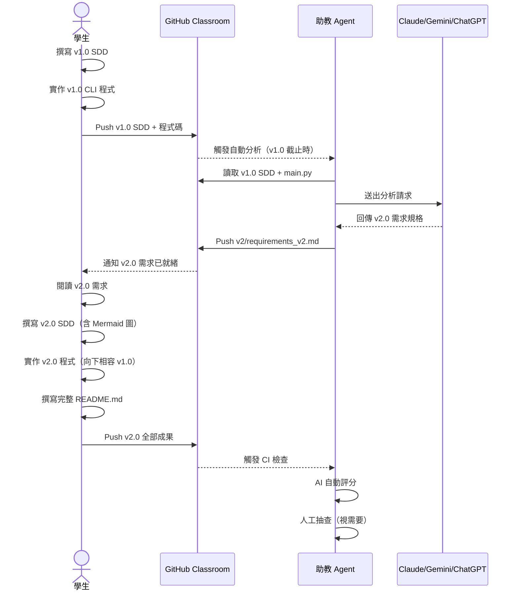
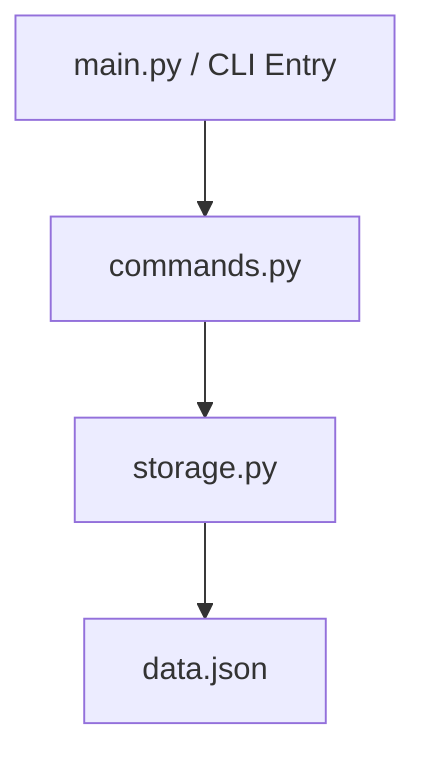
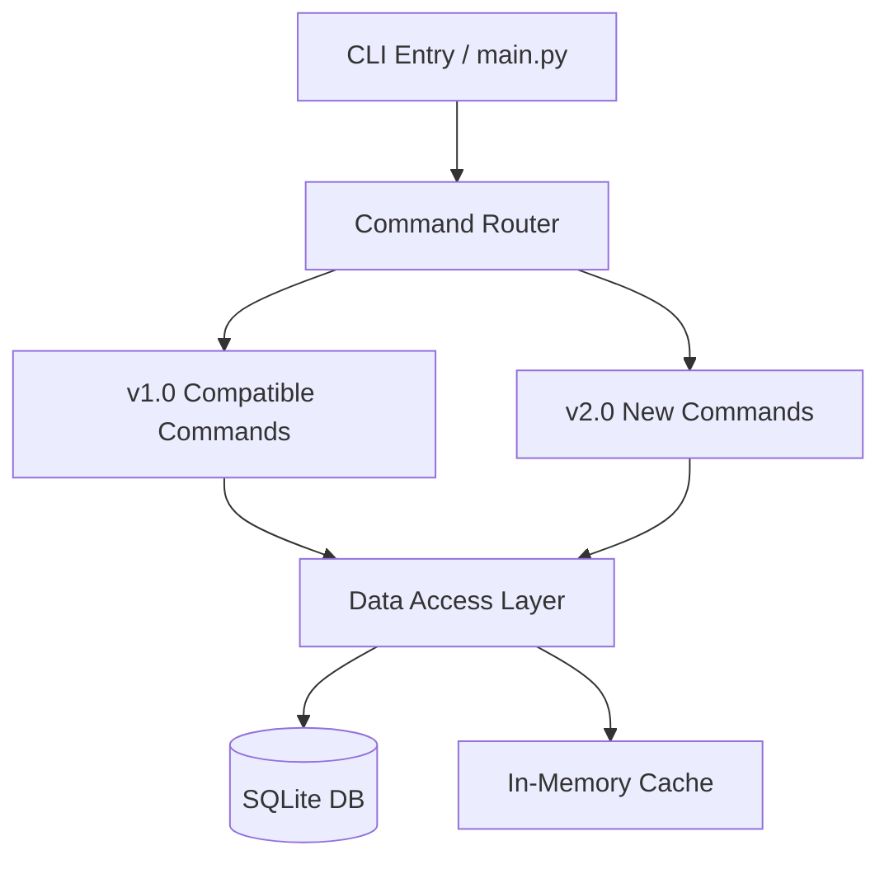
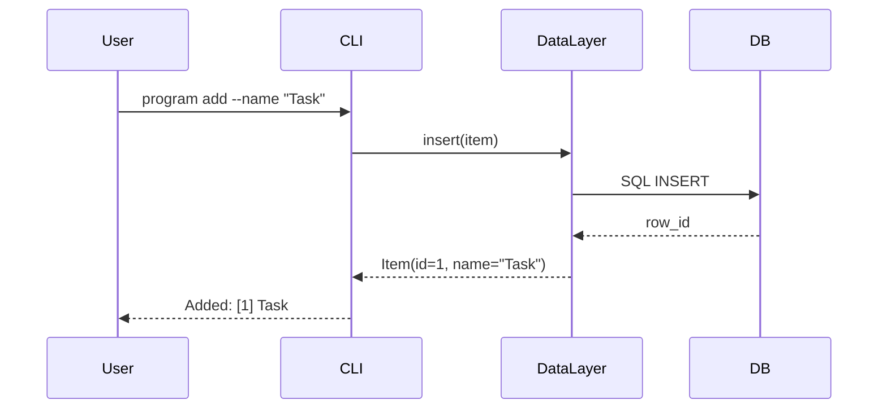

# 📝 作業2：規格 SDD 優化實作

> **課程作業｜Spec-Driven Development — From v1.0 to v2.0**
> 繳交方式：上傳至 GitHub Classroom

---

## Deadline

| 階段 | 截止時間 |
|---|---|
| **v1.0 SDD + 程式碼** | 2026/3/20 23:59 |
| **v2.0 SDD + 程式碼 + README** | 2026/3/31 23:59 |

> 📌 **不允許遲交。v1.0 未於期限內上傳，助教 Agent 將無法產生 v2.0 需求，視同放棄本作業。**

---

## 作業目標

> **SDD Iterative Growth** — 學習以 Spec-Driven Development（規格驅動開發）方式，先撰寫清晰的規格文件，再實作程式；並透過**兩階段優化**，體驗真實工程環境中「功能延伸 + 架構演化」的完整循環。

本作業的核心學習目標：

- 學習如何撰寫**可執行的 SDD 規格文件**，而非模糊的需求說明
- 體驗 **v1.0 → v2.0 向下相容（Backward Compatibility）**的設計挑戰
- Optional - 實踐「以最小修改達成最大延伸」的**架構前瞻性（Forward-Looking Design）**原則
- 理解為何好的規格文件能讓 AI / 他人正確實作你的想法

---

## 作業流程總覽



---

## 📁 必繳檔案結構

```
AIASE2026-HW2/
├── v1/
│   ├── sdd_v1.md            ← v1.0 規格文件（必要）
│   ├── main.py              ← v1.0 主程式（必要）
│   ├── requirements.txt     ← Python 套件清單（optionally）
│   └── ...                  ← 其他 v1.0 程式模組
├── v2/
│   ├── requirements_v2.md   ← 由助教 Agent 自動產生（請勿自行建立）
│   ├── sdd_v2.md            ← v2.0 規格文件（必要）
│   ├── main.py              ← v2.0 主程式（必要）
│   ├── requirements.txt     ← Python 套件清單（optionally）
│   └── ...                  ← 其他 v2.0 程式模組
└── README.md                ← 完整說明文件（必要）
```

> ⚠️ **`sdd_v1.md`、`sdd_v2.md`、`README.md` 及兩個版本的主程式為必要檔案，缺少任一者以 0 分計算。**

> ⚠️ **`v1/` 資料夾內的所有檔案，在 v1.0 截止後不可修改。** 助教 Agent 與 AI 評分均以截止時的 `v1/` 內容為準，若截止後發現 `v1/` 有 commit跟diff後有不同，將以 0 分計算向下相容性分數。

---

## 🧩 第一階段：v1.0 SDD 與 CLI 實作

### 程式主題選擇

你需要**自主提出**一個 CLI（Command-Line Interface）程式題目，主題自由，但須符合以下條件：

| 條件 | 說明 |
|---|---|
| **純 CLI 介面** | 不涉及 Web UI、GUI、前端介面 |
| **程式規模** | v1.0 對應程式碼以 **200–500 行 Python code** 為原則（不含空白行與純註解行） |
| **功能完整性** | v1.0 需有清楚的輸入/輸出行為，可獨立執行 |
| **延伸潛力** | 主題需有空間延伸為 v2.0（含 UI、資料庫或演算法升級），**然而 v2.0 的延伸方向是由 AI 決定** |

**建議主題範例（請自行發揮）：**

| 主題 | v1.0 概念 | 可能的 v2.0 延伸方向 |
|---|---|---|
| 個人任務管理工具 | CLI CRUD + JSON 儲存 | 加入 SQLite、Web API 或優先佇列演算法 |
| 文字統計分析工具 | 讀取文字、計算詞頻 | 加入 NLP library、視覺化輸出、多檔案比較 |
| 個人記帳 CLI | 收支記錄 + 簡易報表 | 加入資料庫、分類統計、匯出 CSV |
| 股票 / 匯率查詢工具 | 呼叫 API + 顯示結果 | 加入歷史紀錄儲存、趨勢分析演算法 |
| 密碼管理工具 | 加密儲存 + 查詢 | 換用更強加密演算法、加入雲端同步機制 |
| 學習字卡工具 | 新增/複習字卡 | 加入 SM-2 間隔重複演算法、統計進度 |

> 💡 上表的「可能 v2.0 延伸方向」僅供參考，**實際方向由 Agent 決定，不保證與上表一致。**

### v1.0 SDD 文件要求（`sdd_v1.md`）

SDD（Spec-Driven Development Document）**不是** PRD，它是**可執行的規格**，應精確到足以讓 AI 或他人直接實作。請包含以下各節：

#### 1. 專案概覽（Project Overview）

```markdown
- 程式名稱：
- 版本：v1.0
- 一句話描述（Elevator Pitch）：
- 目標使用者：
- 核心價值：
```

#### 2. CLI 介面規格（Interface Specification）

列出**所有**指令、參數、旗標（flag）及其行為，格式如下：

```markdown
## 指令規格

### `program <command> [options]`

| 指令 | 參數 | 說明 | 範例 |
|---|---|---|---|
| `add` | `--name TEXT` | 新增項目 | `program add --name "任務A"` |
| `list` | `--all` | 列出所有項目 | `program list --all` |
| `delete` | `--id INT` | 刪除指定項目 | `program delete --id 3` |
```

> 💡 **提示**：CLI 介面規格是 v2.0 **向下相容**的基礎契約。一旦 v1.0 截止，這份介面規格即凍結，v2.0 不可更動任何已定義的參數名稱與行為——只能新增，不能修改或刪除。

#### 3. 資料模型（Data Model）

描述程式所操作的核心資料結構：

```markdown
## 資料模型

### Item
| 欄位 | 型別 | 說明 | 必填 |
|---|---|---|---|
| id | int | 唯一識別碼，自動遞增 | ✅ |
| name | str | 項目名稱 | ✅ |
| created_at | datetime | 建立時間 | ✅ |
```

#### 4. 模組架構（Module Design）

說明程式的模組拆分方式，請**充分使用 Mermaid** 流程圖呈現模組間的依賴關係（不強制，但評分有差別）：

````markdown

````

#### 5. 錯誤處理規格（Error Handling）

| 情境 | 預期行為 | 退出碼 |
|---|---|---|
| 找不到指定 ID | 輸出 `Error: ID not found` | 1 |
| 必填欄位缺失 | 輸出 usage hint | 2 |

#### 6. 測試案例（Test Cases）

列出至少 5 個可驗證的輸入/輸出對：

```markdown
| # | 輸入指令 | 預期輸出 | 通過條件 |
|---|---|---|---|
| 1 | `program add --name "Hello"` | `Added: [1] Hello` | stdout 含 "Added" |
| 2 | `program list` | 列出所有項目表格 | 退出碼 0 |
```

> ⚠️ **此處列出的測試案例將作為 v2.0 向下相容性的驗證基準。** AI 評分時會實際執行這些指令，確認 v2.0 程式的輸出符合預期。請確保測試案例與你的實作一致。

> 📌 **以上內容，請於 `sdd_v1.md` 內提供**

---

### v1.0 程式實作要求

- 語言：建議使用 **Python 3.10+**，可使用 `argparse`、`click`、`typer` 等 CLI library
- 程式碼規模：**200–500 行**（不含空白行與純註解行）
- 程式需可在乾淨環境中，透過 `pip install -r requirements.txt` 後正確執行（請如 HW1 一樣將用到的 library 列於 `requirements.txt`）
- 主程式入口為 `v1/main.py`

---

## 🤖 助教 Agent 自動產生 v2.0 需求

**觸發時機**：Agent 於 **v1.0 截止時間點（3/20 23:59）** 統一讀取各位同學 repo 的最新 commit。請注意：

- ✅ 截止前多次 push 沒問題，Agent 讀取的是截止當下的最新版本
- ❌ 截止後才 push 的內容，Agent **不會**重新觸發
- ❌ `v1/` 資料夾截止後若有異動，向下相容性評分以 0 分計算

Agent 執行流程：

1. 讀取你的 `v1/sdd_v1.md` 與 `v1/main.py`
2. 呼叫 Claude API，分析你的設計並產生 v2.0 需求
3. 將 v2.0 需求以 **`v2/requirements_v2.md`** 的形式，**直接 push 至你的 repo**（非 Pull Request）

> **`v2/requirements_v2.md` 會以 PRD 形式提供，格式較為單一，模擬真實客戶描述需求的口吻，不會太 formal。**

> ⚠️ **v1.0 截止後 48 小時內（最晚 3/22 23:59），`v2/requirements_v2.md` 將出現在你的 repo。** 請以 `git pull` 取得後再開始 v2.0 實作。若超過時限仍未出現，請立即至 Discord 回報。

### v2.0 需求的典型結構

Agent 產生的 v2.0 需求將包含以下類型的延伸，**具體內容因人而異**：

| 類型 | 範例 |
|---|---|
| **UI 延伸** | 加入 TUI（Terminal UI）介面，使用 `rich` 或 `textual` library |
| **資料庫升級** | 將 JSON 儲存替換為 SQLite 或 PostgreSQL |
| **演算法改變** | 排序、搜尋、快取機制的替換或升級 |
| **Library 替換** | 替換 CLI 相關 library |
| **新功能模組** | 加入匯出、統計、通知等功能 |

> 💡 v2.0 需求**會修改到 v1.0 已有的模組與邏輯**，而不僅是新增功能。這是刻意設計的，目的是讓你體驗**架構演化**的挑戰。

---

## 📐 第二階段：v2.0 SDD 與實作

### v2.0 SDD 文件要求（`sdd_v2.md`）

在閱讀 Agent 產生的 v2.0 需求後，你需要撰寫完整的 v2.0 規格文件。**v1.0 SDD 的所有章節均需更新至 v2.0**，並額外新增以下章節：

#### 必要新增章節①：Mermaid 流程圖

v2.0 SDD 中，**必須包含以下至少兩種 Mermaid 圖**（CI 不強制檢查，但 AI 評分時是重要依據）：

**系統架構圖（Architecture Diagram）**

````markdown

````

**核心功能流程圖（Sequence / Flowchart）**

選擇 v2.0 中**最複雜**的功能，繪製其執行流程：

````markdown

````

#### 必要新增章節②：向下相容性說明

在 `sdd_v2.md` 中，必須包含**專門說明向下相容設計的章節**：

```markdown
## 向下相容性設計（Backward Compatibility）

### 保留的 v1.0 介面

| v1.0 指令 | v2.0 行為 | 是否相容 |
|---|---|---|
| `program add --name TEXT` | 行為不變，內部改用 SQLite | ✅ 完全相容 |
| `program list --all` | 輸出格式不變，額外支援新旗標 | ✅ 完全相容 |
| `program delete --id INT` | 行為不變 | ✅ 完全相容 |

### 破壞性變更（Breaking Changes）— Optional
> 本版本無 Breaking Changes。（若有，須明確說明理由與遷移方式）

### 遷移策略（Migration Strategy）— Optional
- v1.0 的 JSON 資料將於首次執行時自動遷移至 SQLite
- 遷移腳本：`python v2/migrate.py`
```

### v2.0 程式實作要求

| 要求 | 說明 |
|---|---|
| **向下相容** | `sdd_v1.md` 中定義的所有 CLI 指令與測試案例，必須在 v2.0 中通過。參數名稱與輸出行為不可更動，可新增但不可刪除或修改。 |
| **最小化架構修改** | 在滿足 v2.0 需求的前提下，盡可能保留 v1.0 的模組結構。AI 評分將比較 `v1/` 與 `v2/` 的程式結構差異量，差異越小、同時功能越完整，分數越高。 |
| **通用性（Generality）** | v2.0 的設計應比 v1.0 更通用，抽象層次更高，便於未來繼續延伸 |
| **程式碼品質** | 新增/修改的程式碼需有適當的函式/類別文件字串（docstring）|
| **可執行性** | 在乾淨環境中可無誤執行所有 v1.0 和 v2.0 功能 |

---

## 📖 README.md 撰寫要求

`README.md` 是你整個作業的**設計思路總記錄**，同時也是 AI 評分的重要依據。請包含以下各節，**越多個人考量與設計決策說明，分數越高**：

### 1. 專案簡介
- v1.0 的功能描述與設計動機
- 從 v1.0 到 v2.0 的演化摘要

### 2. v1.0 設計決策（Design Decisions）

> 💡 這是最重要的章節之一。說明你在設計 v1.0 時，**為了 v2.0 的未來性**做了哪些預先考量——即使你不知道客戶會提出什麼需求，你應該提前思考可能的方向，並在此說明你的預判邏輯。

請以條列方式詳細說明，例如：

- 為什麼選擇 `click` 而非 `argparse`，考慮到未來可擴充性
- 為什麼將資料存取邏輯獨立為 `storage.py`，而非寫在主程式
- 為什麼資料模型包含 `metadata` 欄位，即使 v1.0 未使用
- 指令介面如何設計以確保日後可新增子指令而不破壞現有使用方式
- ...（越多越好，且需說明具體的技術理由）

### 3. v2.0 實作說明

- 說明你如何閱讀並理解 Agent 產生的 v2.0 需求
- 說明你如何將 v2.0 需求映射到 SDD
- 列點說明每一個**非顯而易見的實作選擇**（例如：為何選此遷移策略、快取機制如何設計）

### 4. 向下相容性實作細節

- 說明如何在不修改 v1.0 介面的前提下完成 v2.0
- 若有任何 workaround 或 Adapter Pattern 的使用，請說明原因

### 5. 架構演化比較

請提供 v1.0 與 v2.0 的架構對比（可使用 Mermaid 或表格）：

| 面向 | v1.0 | v2.0 |
|---|---|---|
| 儲存層 | JSON 檔案 | SQLite + 快取 |
| CLI Library | argparse | typer |
| 模組數量 | 2 | 5 |
| 測試方式 | 手動 | unittest |

### 6. 環境需求與執行方式

```bash
# v1.0
cd v1/
pip install -r requirements.txt
python main.py --help

# v2.0
cd v2/
pip install -r requirements.txt
python migrate.py        # 若需資料遷移，否則略過
python main.py --help
```

### 7. 已知限制與未來改進方向

誠實說明目前版本的限制，並提出若有 v3.0 你會如何設計。

---

## 🎯 評分說明

### 自動評分（AI Agent）：60–95 分

| 評分面向 | 配分比重 | 說明 |
|---|---|---|
| **v1.0 應用創新/獨特/意義性** | 15% | 評估提案創意、想法 |
| **v1.0 SDD 品質** | 15% | 規格完整性、可執行性、格式正確性 |
| **v2.0 SDD 品質** | 15% | Mermaid 圖的正確性與完整性、向下相容章節完整度 |
| **v2.0 程式向下相容性、架構變動最小化原則** | 30% | 實際執行 `sdd_v1.md` 中定義的測試案例，驗證 v2.0 程式是否全數通過；在滿足 v2.0 需求的前提下，盡可能保留 v1.0 的模組結構。AI 評分將比較 `v1/` 與 `v2/` 的程式架構差異，差異小、同時功能越完整，分數越高。|
| **README 個人設計思路** | 20% | 條列說明的豐富程度、個人化決策說明的深度 |

- AI 評分會進行相對排序，整體分佈接近 Normal Distribution，$\mu \approx 78$
- AI 評分準則細節事前不公開，期末將公布評分程式碼

### 人工抽查

- 確認程式可正確執行（v1.0 與 v2.0 皆需可執行）
- **無法執行者以 0 分計算**
- 抽查加分：架構設計具有明顯前瞻性與高度通用性（Generalization），老師額外加 **1–5 分**

> 💡 **最高分的策略**：v1.0 的設計就已經「預見」了 v2.0 可能的方向，使得 v2.0 幾乎不需要重構，只需要小幅擴充。這代表你真正理解了 SDD 的精髓。

---

## 🤖 GitHub Actions 自動檢查（CI）

本作業設置兩階段 CI，分別在 v1.0 與 v2.0 push 時觸發：

> ⚠️ **CI 只檢查基本結構與可啟動性，不等於功能正確或向下相容。** 通過 CI 是最低門檻，向下相容性與程式正確性由 AI 評分時實際執行驗證。

### v1.0 CI 檢查項目

- ✅ `v1/sdd_v1.md` 是否存在
- ✅ `v1/main.py` 是否存在
- ✅ `python v1/main.py --help` 執行不報錯（不測試其他指令的 runtime 正確性）

### v2.0 CI 檢查項目

- ✅ `v2/sdd_v2.md` 是否存在
- ✅ `v2/main.py` 是否存在
- ✅ `python v2/main.py --help` 執行不報錯（不測試其他指令的 runtime 正確性）
- ✅ `README.md` 是否存在

---

## 📅 繳交方式

### 第一階段（v1.0）

1. 你應該會被直接加入 GitHub Classroom；如無，請聯絡 TA
2. Clone personal repo 至 local
3. 完成 `v1/sdd_v1.md` 與 `v1/main.py`
4. Push 至 repo，確認 CI 通過

```bash
git add v1/
git commit -m "Submit v1.0: SDD and implementation"
git push origin main
```

### 第二階段（v2.0）

1. **v1.0 截止後**，執行 `git pull` 取得 Agent 產生的 `v2/requirements_v2.md`
2. 閱讀 v2.0 需求，撰寫 `v2/sdd_v2.md` 與實作 `v2/main.py`
3. 撰寫完整 `README.md`
4. Push 至 repo，確認 CI 通過

```bash
git pull origin main          # 先拉取 Agent 產生的 v2.0 需求
git add v2/ README.md
git commit -m "Submit v2.0: SDD, implementation and README"
git push origin main
```

> ⚠️ **`v1/` 資料夾的內容在 v2.0 階段不可修改。** 若需修正 v1.0 的 bug，請在 `v2/` 中以向下相容的方式處理，而非回頭修改 `v1/`。

---

## ❓ 常見問題

**Q：v1.0 可以使用 Python 以外的語言嗎？**
A：建議使用 Python，其他語言（如 Node.js）原則上可以，但 Agent 的分析能力對 Python 最佳，且助教僅保證 Python 環境可正確觸發 CI。其他語言的執行正確性請自行確認。

**Q：v2.0 需求會不會要求我完全重寫 v1.0？**
A：Agent 設計上會刻意避免要求完全重寫，而是要求有意義的延伸與修改。若你的 v1.0 架構設計良好，v2.0 的修改幅度應該很小。

**Q：v2.0 截止後我可以繼續 push 修改嗎？**
A：CI 以截止時間的最新 commit 為準。截止後的 push 不影響評分，但也不建議，以免造成混淆。

**Q：`sdd_v2.md` 中的 Mermaid 圖一定要和實際程式完全一致嗎？**
A：應盡量一致，這是評分重點之一。若實作過程中有調整，請同步更新 SDD，兩者不一致會影響 SDD 品質評分。

**Q：README 有最低字數要求嗎？**
A：沒有硬性字數限制，但 CI 會檢查基本長度門檻。評分重視**個人化的設計思路說明**，流水帳式的操作說明不會得到高分。

**Q：v2.0 `requirements_v2.md` 如果內容看不懂怎麼辦？**
A：這是刻意設計的學習情境——閱讀並理解不完整的規格，是工程師的核心能力。可到 Discord 討論區與同學討論，或使用 AI 輔助理解，但 SDD 與程式實作必須自己完成。

**Q：v1.0 push 之後發現有 bug，可以修改嗎？**
A：v1.0 截止前可以繼續修改並 push。截止後，`v1/` 資料夾凍結，只能在 `v2/` 中處理，不可回頭修改 `v1/`。

---

*如有任何問題，請於 Discord 課程討論區發問。祝大家在迭代中成長！* 🚀