下面用一個現實世界很典型的大型系統來講：

# 大型即時電商平台：訂單、付款、庫存、物流、推薦、客服、風控

這種系統很複雜，因為一次下單會牽動很多服務：

```text
下單 → 付款 → 扣庫存 → 開發票 → 出貨 → 通知 → 推薦 → 風控 → 客服 → 數據分析
```

如果全部服務互相直接呼叫，系統會變成蜘蛛網。
Kafka 的角色就是把這張蜘蛛網變成一條「事件流高速公路」。

---

## Mermaid Diagram

```mermaid
flowchart TB

%% =====================
%% Client Layer
%% =====================
subgraph Client_Layer["Client Layer"]
    Web["Web App"]
    Mobile["Mobile App"]
    Admin["Admin Portal"]
end

%% =====================
%% API Layer
%% =====================
subgraph API_Layer["API Layer"]
    APIGW["API Gateway"]
    Auth["Auth Service"]
    RateLimit["Rate Limit Service"]
end

Web --> APIGW
Mobile --> APIGW
Admin --> APIGW
APIGW --> Auth
APIGW --> RateLimit

%% =====================
%% Core Microservices
%% =====================
subgraph Core_Services["Core Business Microservices"]
    UserSvc["User Service"]
    CatalogSvc["Catalog Service"]
    CartSvc["Cart Service"]
    OrderSvc["Order Service"]
    PaymentSvc["Payment Service"]
    InventorySvc["Inventory Service"]
    PricingSvc["Pricing Service"]
    CouponSvc["Coupon Service"]
    InvoiceSvc["Invoice Service"]
    ShippingSvc["Shipping Service"]
    NotificationSvc["Notification Service"]
    FraudSvc["Fraud Detection Service"]
    ReviewSvc["Review Service"]
    CustomerSvc["Customer Support Service"]
end

APIGW --> UserSvc
APIGW --> CatalogSvc
APIGW --> CartSvc
APIGW --> OrderSvc

OrderSvc --> PricingSvc
OrderSvc --> CouponSvc
OrderSvc --> PaymentSvc
OrderSvc --> InventorySvc

%% =====================
%% Kafka Event Backbone
%% =====================
subgraph Kafka["Kafka Event Backbone"]
    T1["topic: order.created"]
    T2["topic: payment.authorized"]
    T3["topic: payment.failed"]
    T4["topic: inventory.reserved"]
    T5["topic: inventory.failed"]
    T6["topic: order.confirmed"]
    T7["topic: order.cancelled"]
    T8["topic: shipment.created"]
    T9["topic: invoice.created"]
    T10["topic: notification.requested"]
    T11["topic: fraud.signal.detected"]
    T12["topic: customer.event.created"]
    T13["topic: analytics.event"]
    T14["topic: recommendation.event"]
end

%% Producers
OrderSvc --> T1
PaymentSvc --> T2
PaymentSvc --> T3
InventorySvc --> T4
InventorySvc --> T5
OrderSvc --> T6
OrderSvc --> T7
ShippingSvc --> T8
InvoiceSvc --> T9
FraudSvc --> T11
CustomerSvc --> T12

%% Consumers
T1 --> FraudSvc
T1 --> InventorySvc
T1 --> AnalyticsSvc
T1 --> RecommendationSvc

T2 --> OrderSvc
T2 --> InvoiceSvc
T2 --> NotificationSvc
T2 --> AnalyticsSvc

T3 --> OrderSvc
T3 --> NotificationSvc
T3 --> CustomerSvc

T4 --> OrderSvc
T4 --> ShippingSvc

T5 --> OrderSvc
T5 --> NotificationSvc

T6 --> ShippingSvc
T6 --> InvoiceSvc
T6 --> NotificationSvc
T6 --> AnalyticsSvc

T7 --> InventorySvc
T7 --> PaymentSvc
T7 --> NotificationSvc

T8 --> NotificationSvc
T8 --> CustomerSvc

T9 --> NotificationSvc

T11 --> OrderSvc
T11 --> CustomerSvc
T11 --> AnalyticsSvc

T12 --> AnalyticsSvc
T12 --> RecommendationSvc

%% =====================
%% Data / AI / Analytics
%% =====================
subgraph Data_AI_Layer["Data / AI / Analytics Layer"]
    AnalyticsSvc["Analytics Service"]
    RecommendationSvc["Recommendation Service"]
    SearchSvc["Search Index Service"]
    DataLake["Data Lake"]
    FeatureStore["Feature Store"]
    MLTraining["ML Training Pipeline"]
    BI["BI Dashboard"]
end

CatalogSvc --> SearchSvc
T13 --> DataLake
T14 --> FeatureStore

AnalyticsSvc --> T13
RecommendationSvc --> T14
DataLake --> MLTraining
FeatureStore --> RecommendationSvc
DataLake --> BI

%% =====================
%% Storage Layer
%% =====================
subgraph Storage_Layer["Storage Layer"]
    UserDB[("User DB")]
    CatalogDB[("Catalog DB")]
    CartDB[("Cart DB")]
    OrderDB[("Order DB")]
    PaymentDB[("Payment DB")]
    InventoryDB[("Inventory DB")]
    ShippingDB[("Shipping DB")]
    SupportDB[("Support DB")]
end

UserSvc --> UserDB
CatalogSvc --> CatalogDB
CartSvc --> CartDB
OrderSvc --> OrderDB
PaymentSvc --> PaymentDB
InventorySvc --> InventoryDB
ShippingSvc --> ShippingDB
CustomerSvc --> SupportDB

%% =====================
%% External Systems
%% =====================
subgraph External_Systems["External Systems"]
    Bank["Bank / Payment Gateway"]
    Logistics["Logistics Provider"]
    EmailSMS["Email / SMS / LINE Provider"]
    TaxSystem["E-Invoice / Tax System"]
end

PaymentSvc --> Bank
ShippingSvc --> Logistics
NotificationSvc --> EmailSMS
InvoiceSvc --> TaxSystem
```



---

# Plain explanation

這是一個大型電商平台。使用者按下「下單」時，表面上只是買東西，背後其實是一連串事件。

## 1. 沒有 Kafka 時，系統會變很亂

假設 `Order Service` 直接呼叫所有服務：

```text
Order Service → Payment Service
Order Service → Inventory Service
Order Service → Invoice Service
Order Service → Shipping Service
Order Service → Notification Service
Order Service → Fraud Detection Service
Order Service → Analytics Service
```

這會造成一個問題：

`Order Service` 變成上帝服務。

它要知道付款怎麼做、庫存怎麼扣、物流怎麼建、通知怎麼發、發票怎麼開、風控怎麼判斷。

一旦其中一個服務壞掉，下單流程就可能卡住。

---

## 2. Kafka 的做法：每個服務只發事件

Kafka 會把流程改成：

```text
Order Service 不用直接叫所有人。
Order Service 只需要發出：order.created
```

接著其他服務自己訂閱這個事件：

```text
Inventory Service 看到 order.created → 去保留庫存
Fraud Service 看到 order.created → 做風險判斷
Analytics Service 看到 order.created → 記錄分析資料
Recommendation Service 看到 order.created → 更新推薦模型訊號
```

這樣系統變乾淨很多。

---

# 一筆訂單的完整流程

## Step 1：使用者建立訂單

```text
User → API Gateway → Order Service
```

`Order Service` 建立訂單後，送出事件：

```text
topic: order.created
```

這個事件代表：

```text
有人建立了一筆訂單。
```

它可能長這樣：

```json
{
  "event_id": "evt_001",
  "event_type": "order.created",
  "order_id": "ORD_20260429_001",
  "user_id": "U123",
  "items": [
    {
      "sku": "IPHONE_CASE_001",
      "quantity": 1
    }
  ],
  "total_amount": 890,
  "created_at": "2026-04-29T14:20:00+08:00"
}
```

---

## Step 2：多個服務同時反應

`order.created` 出現後，很多服務會同時開始工作：

```text
Inventory Service → 檢查庫存
Payment Service → 準備付款
Fraud Detection Service → 判斷是否可疑
Analytics Service → 記錄行為
Recommendation Service → 更新使用者興趣
```

每個服務只管自己的事。

---

## Step 3：付款成功

付款服務完成後送出：

```text
topic: payment.authorized
```

意思是：

```text
付款已授權成功。
```

接著：

```text
Order Service → 更新訂單狀態
Invoice Service → 開發票
Notification Service → 通知使用者付款成功
Analytics Service → 記錄轉換事件
```

---

## Step 4：庫存保留成功

庫存服務送出：

```text
topic: inventory.reserved
```

接著：

```text
Order Service → 確認訂單可以成立
Shipping Service → 準備建立出貨單
```

---

## Step 5：訂單確認

當付款成功、庫存成功，`Order Service` 送出：

```text
topic: order.confirmed
```

接著：

```text
Shipping Service → 建立物流單
Invoice Service → 開正式發票
Notification Service → 發送訂單確認通知
Analytics Service → 記錄成交
```

---

## Step 6：物流建立

物流服務送出：

```text
topic: shipment.created
```

接著：

```text
Notification Service → 告訴使用者已準備出貨
Customer Support Service → 更新客服可查詢狀態
```

---

# Kafka 在這裡解決什麼問題？

## 1. 解耦

服務之間不需要互相認識。

`Order Service` 不需要知道誰會用 `order.created`。
它只負責把事件丟出來。

這讓系統更容易擴充。

---

## 2. 非同步

很多事情不用卡在下單當下完成。

例如：

```text
推薦模型更新
數據分析
通知
客服狀態同步
```

這些可以慢一點處理。

使用者不需要等全部完成才看到訂單成立。

---

## 3. 可重放

Kafka 會保存事件。

如果 `Analytics Service` 壞了兩小時，修好後可以從 Kafka 把剛剛漏掉的事件重新讀回來。

這對大型系統超重要。

---

## 4. 可審計

每一步都有事件紀錄：

```text
order.created
payment.authorized
inventory.reserved
order.confirmed
shipment.created
invoice.created
```

出問題時，可以回頭查：

```text
這筆訂單到底卡在哪裡？
付款成功了嗎？
庫存有保留嗎？
物流有建立嗎？
通知有發出嗎？
```

---

## 5. 高流量處理

大促銷時，流量可能瞬間暴增。

例如雙 11：

```text
每秒幾萬筆下單事件
```

Kafka 可以先把事件接住，後面的服務慢慢消化。

這叫削峰填谷。

---

# 最重要的系統設計觀念

Kafka 不是拿來取代微服務。
Kafka 是讓微服務之間不要互相綁死。

你可以這樣理解：

```text
微服務 = 一群專業部門
Kafka = 公司內部的事件公告系統
```

訂單部門說：

```text
我剛剛建立一筆訂單。
```

庫存部門自己去看。
付款部門自己去看。
數據部門自己去看。
客服部門自己去看。

沒有人需要一直打電話問別人。

---

# 什麼時候需要 Kafka？

當你的系統符合這些特徵，就值得考慮 Kafka：

```text
多個服務需要吃同一份事件
資料量大
流程很長
需要非同步處理
需要重放
需要 audit trail
服務之間不想直接依賴
```

# 什麼時候不需要？

如果只是小型系統：

```text
前端 → 後端 API → 資料庫
```

那 Kafka 會太重。

小系統先用：

```text
REST API
PostgreSQL
Redis Queue
Celery / BullMQ
```

就夠了。

---

# 對你的 AI / 詐騙偵測系統的啟發

大型電商的 `order.created`，在你的系統裡可以對應成：

```text
fraud.signal.ingested
transcript.created
url.extracted
risk.signal.detected
novelty.candidate.created
human.review.required
```

也就是：

```text
不是每個服務互相 call。
每個服務產生事件，下一個服務自己接。
```

這會讓你的系統從「一條 AI pipeline」升級成：

```text
可重放、可審計、可擴充的事件驅動 AI 系統。
```
